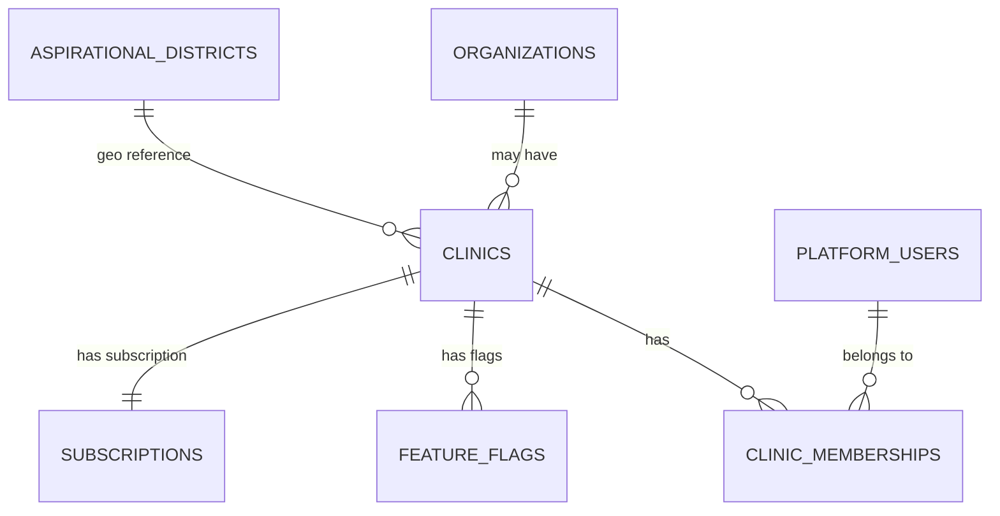

# 00.1 — Master Database Schema

> **Database**: `lipi_master`  
> **Purpose**: Cross-clinic data — organizations, clinics, platform users, feature flags, aspirational districts  
> **SQL Source**: `database/master/001_schema_master.sql`  
> **EF Core**: `database/efcore/LiPi.Master/`

---

## SCHEMA OVERVIEW

The Master DB is shared across all clinics. It tracks:
- Organizations (parent entities, optional)
- Clinics (the actual hospitals/clinics)
- Platform users (staff who can access multiple clinics)
- Feature flags (per-clinic toggles)
- Aspirational districts (NITI Aayog 112 districts authority list)
- Subscriptions (per-clinic plan/billing)

**Key principle**: NO clinical data here. PHI lives in clinic DBs only.

---

## TABLES

### `master.organizations`
Parent entity (optional) — for hospital chains, university systems, etc.

| Column | Type | Notes |
|--------|------|-------|
| `id` | UUID | PK |
| `name` | VARCHAR(200) | NOT NULL |
| `legal_name` | VARCHAR(300) | NOT NULL |
| `type` | VARCHAR(50) | hospital_chain / university / govt / other |
| `gstin` | VARCHAR(15) | Optional |
| `pan` | VARCHAR(10) | Optional |
| `address_*` | (multiple) | Plain text address fields |
| `created_at` | TIMESTAMPTZ | DEFAULT NOW() |
| `deleted_at` | TIMESTAMPTZ | Soft delete |

### `master.clinics`
The actual clinics/hospitals.

| Column | Type | Notes |
|--------|------|-------|
| `clinic_id` | UUID | PK |
| `organization_id` | UUID | NULL allowed (clinic without org) |
| `name` | VARCHAR(200) | NOT NULL |
| `legal_name` | VARCHAR(300) | NOT NULL |
| `type` | VARCHAR(50) | cancer / multi_specialty / specialty |
| `clinic_db_name` | VARCHAR(100) | The dedicated PostgreSQL database name |
| `db_host` | VARCHAR(200) | Connection details (encrypted) |
| `db_port` | INTEGER | Required |
| `db_username` | VARCHAR(100) | Required |
| `encrypted_db_password` | TEXT | Required, encrypted |
| `encrypted_connection_string` | TEXT | Required, encrypted |
| `status` | VARCHAR(20) | active / suspended / pending_setup |
| `created_at` | TIMESTAMPTZ | |
| `deleted_at` | TIMESTAMPTZ | Soft delete |

**Indexes**:
- `uq_clinics_clinic_db_name` (UNIQUE)
- `idx_clinics_organization_id`
- `idx_clinics_status`

### `master.platform_users`
Staff who can access the system (across one or many clinics).

| Column | Type | Notes |
|--------|------|-------|
| `user_id` | UUID | PK |
| `username` | VARCHAR(100) | UNIQUE NOT NULL |
| `email` | VARCHAR(200) | UNIQUE NOT NULL |
| `mobile` | VARCHAR(20) | NOT NULL |
| `password_hash` | TEXT | Argon2id |
| `password_changed_at` | TIMESTAMPTZ | For 90-day expiry |
| `must_change_password` | BOOLEAN | DEFAULT false |
| `mfa_enabled` | BOOLEAN | DEFAULT false |
| `is_global_admin` | BOOLEAN | DEFAULT false (only Admin) |
| `is_sys_admin` | BOOLEAN | DEFAULT false |
| `status` | VARCHAR(20) | active/suspended/locked/invited/terminated |
| `failed_login_count` | INTEGER | Auto-lock at 5 |
| `locked_until` | TIMESTAMPTZ | NULL when not locked |
| `created_at` | TIMESTAMPTZ | |
| `deleted_at` | TIMESTAMPTZ | NEVER for system admins |

**Indexes**:
- `uq_platform_users_username` (UNIQUE)
- `uq_platform_users_email` (UNIQUE)
- `idx_platform_users_status`

### `master.clinic_memberships`
Which platform users belong to which clinics, with which roles.

| Column | Type | Notes |
|--------|------|-------|
| `id` | UUID | PK |
| `user_id` | UUID | FK to platform_users |
| `clinic_id` | UUID | FK to clinics |
| `is_site_admin` | BOOLEAN | DEFAULT false |
| `created_at` | TIMESTAMPTZ | |
| `deleted_at` | TIMESTAMPTZ | Soft delete |

### `master.aspirational_districts`
NITI Aayog 112 aspirational districts (authority list).

| Column | Type | Notes |
|--------|------|-------|
| `id` | UUID | PK |
| `district_name` | VARCHAR(100) | |
| `state_name` | VARCHAR(100) | |
| `is_active` | BOOLEAN | DEFAULT true |
| `created_at` | TIMESTAMPTZ | |

Used by patient registration to flag aspirational district patients (denormalized into `clinic.core.addresses.is_aspirational`).

### `master.feature_flags`
Per-clinic feature toggles.

| Column | Type | Notes |
|--------|------|-------|
| `id` | UUID | PK |
| `clinic_id` | UUID | FK |
| `flag_key` | VARCHAR(100) | e.g., "teleconsult_enabled" |
| `flag_value` | BOOLEAN | DEFAULT false |
| `enabled_by` | UUID | FK to platform_users |
| `enabled_at` | TIMESTAMPTZ | |

### `master.subscriptions`
Per-clinic subscription/billing.

| Column | Type | Notes |
|--------|------|-------|
| `id` | UUID | PK |
| `clinic_id` | UUID | FK |
| `plan` | VARCHAR(50) | basic / pro / enterprise |
| `status` | VARCHAR(20) | active / overdue / cancelled |
| `started_at` | TIMESTAMPTZ | |
| `expires_at` | TIMESTAMPTZ | |

---

## ENTITY RELATIONSHIPS

Full diagram: See `database/diagrams/master.mmd`

---

## CRITICAL RULES

1. **Platform users are GLOBAL** — they can have access to multiple clinics
2. **Clinics have isolated databases** — connection details stored encrypted here
3. **System admins are undeletable** — Global Admin, SysAdmin, SiteAdmin protected at app + DB level
4. **No clinical data** — strictly metadata + cross-clinic auth
5. **Password storage** — Argon2id only, never plaintext, never in logs
6. **Connection strings** — always encrypted at rest, decrypted only at runtime

---

## EF CORE MAPPING

See entity classes in:
- `database/efcore/LiPi.Master/Entities/Organization.cs`
- `database/efcore/LiPi.Master/Entities/Clinic.cs`
- `database/efcore/LiPi.Master/Entities/PlatformUser.cs`
- `database/efcore/LiPi.Master/Entities/ClinicMembership.cs`
- `database/efcore/LiPi.Master/Entities/AspirationalDistrict.cs`
- `database/efcore/LiPi.Master/Entities/FeatureFlag.cs`
- `database/efcore/LiPi.Master/Entities/Subscription.cs`

DbContext: `database/efcore/LiPi.Master/MasterDbContext.cs`

---

## TEST VALIDATION

Test runner verifies:
- ✓ All tables exist with correct columns
- ✓ Foreign keys enforced
- ✓ Unique constraints work
- ✓ Soft delete (deleted_at) doesn't affect queries with WHERE deleted_at IS NULL
- ✓ Encrypted columns are not plaintext
- ✓ Password hashes are Argon2id format

See `test-automation-guide.md` for details.
