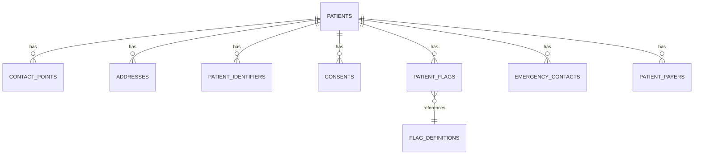

# 00.2 — Clinic Core Database Schema

> **Database**: One per clinic (e.g., `lipi_clinic_<clinic_id>`)  
> **Purpose**: Patient core data — clinical, immutable, append-only  
> **SQL Source**: `database/clinic/01_core_v3.sql`  
> **EF Core**: `database/efcore/LiPi.Clinic.Core/`

---

## ARCHITECTURAL PRINCIPLES

### 1. Immutable / Append-Only
**No row is ever UPDATE'd or DELETE'd.** Every change = new INSERT.

```
Pattern for ALL patient tables:
├── id            UUID         (THIS version's ID — changes on edit)
├── entity_id     UUID         (Stable patient/record ID — used in FKs, never changes)
├── previous_id   UUID NULL    (FK to row this version supersedes; NULL = first version)
├── valid_from    TIMESTAMPTZ  (When this version became active)
├── valid_to      TIMESTAMPTZ  (NULL if current; set when superseded)
├── changed_by    UUID         (Master DB user UUID)
└── change_reason TEXT         (Mandatory on edit)
```

**Current version query**: `WHERE valid_to IS NULL`  
**History query**: `WHERE entity_id = X ORDER BY valid_from DESC`

### 2. Tables with Immutable Pattern
- `core.patients`
- `core.contact_points`
- `core.addresses`
- `core.patient_identifiers`
- `core.patient_payers`
- `core.emergency_contacts`

### 3. Append-Only by Nature
- `core.patient_flags` (each flag = new row, never edited)
- `core.consents` (each consent = new row)

### 4. Plain Text Address (No Geodata FKs)
Addresses store city/district/state as plain text — NO foreign keys to master geodata tables.
**Reason**: Avoids master DB dependency at save time. City/state names are well-known.
- `is_aspirational` denormalized boolean (set from master.aspirational_districts at save)
- Background job refreshes if aspirational list changes

---

## TABLES

### `core.patients` (collapsed persons + patients)

| Column | Type | Notes |
|--------|------|-------|
| `id` | UUID | PK (this version) |
| `entity_id` | UUID | Stable patient ID |
| `previous_id` | UUID | FK to prior version |
| `valid_from`, `valid_to` | TIMESTAMPTZ | Versioning |
| `changed_by` | UUID | Master DB user UUID |
| `change_reason` | TEXT | Mandatory on edit |
| `uhid` | VARCHAR(20) | Format: PT-YYYY-XXXXXX (Luhn optional) |
| `first_name` | VARCHAR(100) | |
| `middle_name` | VARCHAR(100) | NULL allowed |
| `last_name` | VARCHAR(100) | |
| `display_name` | TEXT GENERATED STORED | Auto-computed from name parts |
| `dob` | DATE | NULL if unknown |
| `dob_confidence` | VARCHAR(20) | verified / self_reported / estimated / unknown |
| `dob_overridden_by` | UUID | NULL unless overridden |
| `dob_overridden_at` | TIMESTAMPTZ | |
| `gender` | VARCHAR(20) | male / female / other / undisclosed |
| `mrn` | VARCHAR(50) | Optional, may be NULL |
| `referral_source` | VARCHAR(20) | doctor/self/emergency/camp/transfer/online/other |

**Indexes**:
- `idx_patients_entity_id` (for history queries)
- `idx_patients_uhid` (UNIQUE WHERE valid_to IS NULL)
- `idx_patients_display_name` (for search)

### `core.contact_points`
Multiple phones/emails per patient.

| Column | Type | Notes |
|--------|------|-------|
| `id` | UUID | PK (this version) |
| `entity_id` | UUID | Stable contact ID |
| `patient_entity_id` | UUID | FK to patients.entity_id |
| `previous_id` | UUID NULL | |
| `valid_from`, `valid_to` | TIMESTAMPTZ | |
| `type` | VARCHAR(20) | mobile / home / work / email |
| `value` | VARCHAR(200) | The phone or email |
| `is_primary` | BOOLEAN | DEFAULT false |
| `country_code` | VARCHAR(5) | For phones (e.g., "+91") |

### `core.addresses`
Patient addresses (current + permanent + historical).

| Column | Type | Notes |
|--------|------|-------|
| `id` | UUID | PK |
| `entity_id` | UUID | Stable address ID |
| `patient_entity_id` | UUID | FK |
| `previous_id` | UUID NULL | |
| `valid_from`, `valid_to` | TIMESTAMPTZ | |
| `type` | VARCHAR(20) | current / permanent / mailing |
| `line1` | VARCHAR(200) | |
| `line2` | VARCHAR(200) | NULL allowed |
| `city` | VARCHAR(100) | Plain text (no FK) |
| `district` | VARCHAR(100) | Plain text |
| `state` | VARCHAR(100) | Plain text |
| `pincode` | VARCHAR(10) | India: 6-digit |
| `country` | VARCHAR(100) | DEFAULT 'India' |
| `is_aspirational` | BOOLEAN | Denormalized at save time |

### `core.patient_identifiers`
Aadhaar, ABHA, Passport, etc.

| Column | Type | Notes |
|--------|------|-------|
| `id` | UUID | PK |
| `entity_id` | UUID | Stable identifier ID |
| `patient_entity_id` | UUID | FK |
| `previous_id` | UUID NULL | |
| `valid_from`, `valid_to` | TIMESTAMPTZ | |
| `type` | VARCHAR(20) | aadhaar / abha / passport / driving_license |
| `value` | TEXT | Encrypted (AES-256-GCM) |
| `value_hash` | VARCHAR(64) | SHA-256 of value (for duplicate check) |
| `verified` | BOOLEAN | DEFAULT false |
| `verified_at` | TIMESTAMPTZ | |
| `verified_by` | UUID | |

**HIPAA**: `value` MUST be encrypted at rest. `value_hash` enables duplicate checks without decryption.

### `core.consents`
Patient consents (treatment, research, communication).

| Column | Type | Notes |
|--------|------|-------|
| `id` | UUID | PK |
| `patient_entity_id` | UUID | FK |
| `consent_type` | VARCHAR(50) | treatment / research / sms / email |
| `granted` | BOOLEAN | true/false |
| `granted_at` | TIMESTAMPTZ | |
| `expires_at` | TIMESTAMPTZ | NULL = no expiry |
| `version` | VARCHAR(20) | Consent form version |
| `signed_by` | UUID | Patient or guardian |
| `witnessed_by` | UUID | Optional |

### `core.patient_flags`
Configurable flags per patient (allergies, VIP, special needs).

| Column | Type | Notes |
|--------|------|-------|
| `id` | UUID | PK |
| `patient_entity_id` | UUID | FK |
| `flag_key` | VARCHAR(100) | From flag_definitions |
| `flag_value` | TEXT | |
| `flagged_by` | UUID | |
| `flagged_at` | TIMESTAMPTZ | |
| `reason` | TEXT | |

### `core.flag_definitions`
Customizable flag types per clinic.

| Column | Type | Notes |
|--------|------|-------|
| `id` | UUID | PK |
| `key` | VARCHAR(100) | UNIQUE |
| `display_name` | VARCHAR(200) | |
| `description` | TEXT | |
| `color` | VARCHAR(7) | Hex color for UI badge |
| `is_active` | BOOLEAN | DEFAULT true |

### `core.emergency_contacts`
Patient emergency contacts (immutable).

| Column | Type | Notes |
|--------|------|-------|
| `id` | UUID | PK |
| `entity_id` | UUID | Stable contact ID |
| `patient_entity_id` | UUID | FK |
| `previous_id`, `valid_from`, `valid_to` | (Versioning) | |
| `name` | VARCHAR(200) | |
| `relationship` | VARCHAR(50) | spouse / parent / child / sibling / other |
| `phone` | VARCHAR(20) | |
| `is_primary` | BOOLEAN | |

### `core.patient_payers`
Insurance / TPA / payer info per patient.

| Column | Type | Notes |
|--------|------|-------|
| `id` | UUID | PK |
| `entity_id` | UUID | |
| `patient_entity_id` | UUID | FK |
| `previous_id`, `valid_from`, `valid_to` | (Versioning) | |
| `payer_type` | VARCHAR(50) | self / insurance / tpa / govt / corporate |
| `payer_name` | VARCHAR(200) | |
| `policy_number` | TEXT | Encrypted |
| `validity_from`, `validity_to` | DATE | |

---

## ER DIAGRAM



Full diagram: `database/diagrams/clinic_01_core.mmd`

---

## EF CORE — CRITICAL RULES (LOCKED)

### Rule 1: Nothing Added to ClinicCoreDbContext Unless Current Sprint Needs It
EF Core validates ALL entities at startup. Adding unused entities causes validation errors that block startup.

### Rule 2: Shadow FK Bug Prevention
Nav property name + PK name = generated column name.
```csharp
// BUG: Generates column "DeathCauseCodeCode"
public DeathCauseCode DeathCauseCode { get; set; }

// FIX: Always explicitly configure non-conventional FKs
modelBuilder.Entity<Patient>()
  .HasOne(p => p.DeathCauseCode)
  .WithMany()
  .HasForeignKey(p => p.DeathCauseCodeId);
```

### Rule 3: Patient.DisplayName is GENERATED STORED
```csharp
// In Patient.cs
public string DisplayName { get; set; }

// In ClinicCoreDbContext OnModelCreating:
modelBuilder.Entity<Patient>()
  .Property(p => p.DisplayName)
  .ValueGeneratedOnAddOrUpdate()  // ← Critical
  .HasComputedColumnSql(
    "TRIM(COALESCE(first_name,'') || ' ' || COALESCE(middle_name,'') || ' ' || COALESCE(last_name,''))",
    stored: true);
```

### Rule 4: ClinicDbFactory Returns NULL When Clinic DB Missing
Never falls back to IdentityConnection. Throws or returns null.

---

## HIPAA & ENCRYPTION

| Field | Encryption |
|-------|-----------|
| `patient_identifiers.value` | AES-256-GCM at rest |
| `patient_payers.policy_number` | AES-256-GCM at rest |
| All patient names, DOB, addresses | At-rest via PostgreSQL TDE (Transparent Data Encryption) |
| Audit logs | Hash-chained (cryptographic integrity) |

**Logs**: NEVER log patient names, DOB, identifiers. Always use entity_id only.

---

## REFERENCES

- **SQL Source**: `database/clinic/01_core_v3.sql`
- **Geodata Seed**: `database/clinic/02_geodata_seed.sql`
- **Identity Schema**: `database/clinic/02_identity.sql` (in same DB)
- **Audit Schema**: `database/clinic/04_audit.sql` (in same DB)
- **Data Dictionary**: `database/data-dictionary/clinic_01_core.md` (technical reference)
- **EF Core Entities**: `database/efcore/LiPi.Clinic.Core/Entities/`
