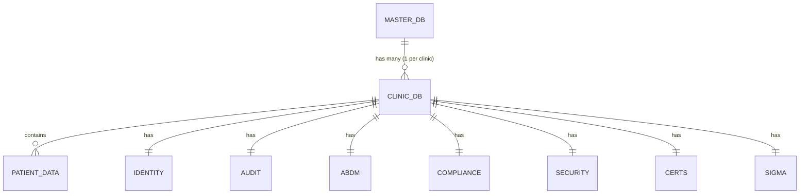
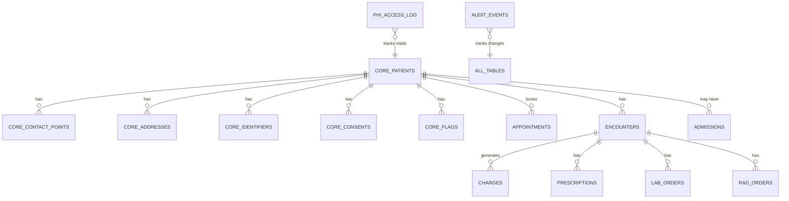

# 00.3 — ER Diagram Overview

> **Purpose**: High-level cross-module relationships  
> **Detailed diagrams**: `database/diagrams/clinic_*.mmd`  
> **Format**: Mermaid (auto-rendered)

---

## DATABASES OVERVIEW



---

## SCHEMAS WITHIN A CLINIC DB



---

## MODULE-TO-SCHEMA MAPPING

| Module | Primary Schema | Cross-References |
|--------|----------------|------------------|
| 01-User Registration | master.platform_users | identity.users (clinic) |
| 02-Clinic Registration | master.clinics | All clinic schemas (provisioning) |
| 03-Org Registration | master.organizations | master.clinics |
| 04-Patient Registration | core.patients | identifiers, addresses, contacts, consents |
| 05-Appointments | core.appointments | core.patients, identity.users |
| 06-OPD | core.encounters (OPD type) | appointments, prescriptions, lab/rad orders |
| 07-IPD | core.admissions | encounters, beds, charges |
| 08-Radiology | rad.* schema | core.patients, encounters, PACS |
| 09-Pharmacy | pharmacy.* | prescriptions, inventory, dispensing |
| 10-CSSD | cssd.* | sterilization tracking, instruments |
| 11-OT | ot.* | surgeries, OT scheduling, instrument trays |
| 12-Dental | dental.* | charts, treatments, dental encounters |
| 13-Lab | lab.* | orders, samples, results, panels |
| 14-Cathlab | cathlab.* | procedures, equipment, recovery |
| 15-Chemotherapy | chemo.* | regimens, infusions, side-effect tracking |
| 16-Radiotherapy | rt.* | treatment plans, fractions, dosimetry |
| 17-Med Physics QA | physics.* | machine QA, equipment calibration |
| 18-Dialysis | dialysis.* | sessions, water quality, machine logs |
| 19-Insurance/TPA | insurance.* | claims, pre-auth, settlements |
| 20-Billing | billing.* | charges, payments, invoices, refunds |
| 21-Asset Management | assets.* | equipment, depreciation, maintenance |
| 22-Compliance | compliance.* | NABH/HIPAA/AERB checklists |
| 23-Purchase | purchase.* | POs, vendors, GRN, inventory |
| 24-Ticket Management | tickets.* | IT/facility tickets, SLA tracking |
| 25-PACS | pacs.* | DICOM images, viewer state, annotations |

---

## DESIGN PATTERNS

### Pattern 1: Immutable Patient Tables
All patient-related tables follow:
```
id, entity_id, previous_id, valid_from, valid_to, changed_by, change_reason
```

### Pattern 2: Cross-Module References Use entity_id
NEVER reference `id` (the version ID). Always reference `entity_id` (the stable ID).

```sql
-- WRONG
appointments.patient_id REFERENCES patients.id  -- Will break on patient edit!

-- CORRECT
appointments.patient_entity_id REFERENCES patients.entity_id
```

### Pattern 3: Soft Delete Everywhere (Non-Patient Tables)
```sql
-- Master, Identity, Settings tables
deleted_at TIMESTAMPTZ NULL
```

### Pattern 4: Audit Trail
Every INSERT/UPDATE/DELETE on PHI tables triggers an `audit.audit_events` row.
- `before_state` (JSON snapshot)
- `after_state` (JSON snapshot)
- `previous_hash` + `current_hash` (chain integrity)

---

## DETAILED DIAGRAMS

For per-schema ER diagrams (Mermaid format):
- `database/diagrams/master.mmd`
- `database/diagrams/clinic_01_core.mmd` (patients, contacts, addresses)
- `database/diagrams/clinic_02_identity.mmd` (users, roles, sessions)
- `database/diagrams/clinic_03_abdm.mmd` (ABHA, FHIR R4)
- `database/diagrams/clinic_04_audit.mmd` (hash chain, blockchain anchor)
- `database/diagrams/clinic_05_security.mmd` (policies, MFA)
- `database/diagrams/clinic_06_compliance.mmd` (NABH, HIPAA checks)
- `database/diagrams/clinic_07_certs.mmd` (digital cert tracking)
- `database/diagrams/clinic_08_sigma.mmd` (Six Sigma metrics)

---

## RENDERING DIAGRAMS

Mermaid diagrams render automatically in:
- GitHub README files
- VS Code with Mermaid extension
- Docusaurus / GitBook
- Any markdown viewer with Mermaid support

To export as PNG/SVG:
```bash
npx @mermaid-js/mermaid-cli -i input.mmd -o output.png
```
