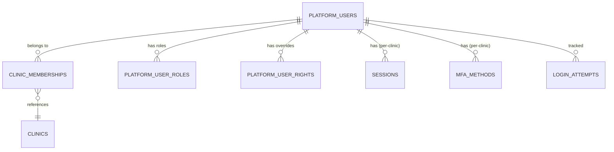

# 01.3 — User Registration: Database Schema

> **Module**: User Registration  
> **Schemas**: `master.platform_users`, `clinic.identity.users`, `master.clinic_memberships`  
> **EF Core**: `LiPi.Master`, `LiPi.Clinic.Identity`

---

## TABLES

### `master.platform_users` (Primary)
**Purpose**: Cross-clinic platform user accounts.

```sql
CREATE TABLE master.platform_users (
  user_id                UUID PRIMARY KEY DEFAULT gen_random_uuid(),
  username               VARCHAR(100) NOT NULL,
  email                  VARCHAR(200) NOT NULL,
  mobile                 VARCHAR(20) NOT NULL,
  password_hash          TEXT NOT NULL,           -- Argon2id
  password_changed_at    TIMESTAMPTZ DEFAULT NOW(),
  must_change_password   BOOLEAN DEFAULT FALSE,
  mfa_enabled            BOOLEAN DEFAULT FALSE,
  is_global_admin        BOOLEAN DEFAULT FALSE,
  is_sys_admin           BOOLEAN DEFAULT FALSE,
  
  -- Personal info
  first_name             VARCHAR(100) NOT NULL,
  middle_name            VARCHAR(100),
  last_name              VARCHAR(100) NOT NULL,
  display_name           TEXT GENERATED ALWAYS AS (
    TRIM(COALESCE(first_name,'') || ' ' || COALESCE(middle_name,'') || ' ' || COALESCE(last_name,''))
  ) STORED,
  dob                    DATE,
  gender                 VARCHAR(20),
  photo_url              TEXT,
  
  -- Employment
  designation            VARCHAR(100),
  department             VARCHAR(100),
  joining_date           DATE,
  employee_id            VARCHAR(50),
  
  -- Status
  status                 VARCHAR(20) NOT NULL DEFAULT 'active',
  failed_login_count     INTEGER DEFAULT 0,
  locked_until           TIMESTAMPTZ,
  last_login_at          TIMESTAMPTZ,
  last_login_ip          INET,
  
  -- Audit
  created_at             TIMESTAMPTZ DEFAULT NOW(),
  created_by             UUID,
  updated_at             TIMESTAMPTZ,
  updated_by             UUID,
  deleted_at             TIMESTAMPTZ,                 -- Soft delete (NEVER for system admins)
  
  CONSTRAINT chk_status CHECK (status IN ('active','suspended','locked','invited','terminated'))
);

CREATE UNIQUE INDEX uq_platform_users_username 
  ON master.platform_users(username) WHERE deleted_at IS NULL;

CREATE UNIQUE INDEX uq_platform_users_email 
  ON master.platform_users(email) WHERE deleted_at IS NULL;

CREATE INDEX idx_platform_users_status ON master.platform_users(status);
CREATE INDEX idx_platform_users_display_name ON master.platform_users(display_name);
```

### `master.clinic_memberships`
**Purpose**: Which platform users belong to which clinics, with site admin flag.

```sql
CREATE TABLE master.clinic_memberships (
  id              UUID PRIMARY KEY DEFAULT gen_random_uuid(),
  user_id         UUID NOT NULL REFERENCES master.platform_users(user_id),
  clinic_id       UUID NOT NULL REFERENCES master.clinics(clinic_id),
  is_site_admin   BOOLEAN DEFAULT FALSE,
  created_at      TIMESTAMPTZ DEFAULT NOW(),
  created_by      UUID,
  deleted_at      TIMESTAMPTZ,
  
  CONSTRAINT uq_user_clinic UNIQUE (user_id, clinic_id)
);

CREATE INDEX idx_memberships_user_id ON master.clinic_memberships(user_id);
CREATE INDEX idx_memberships_clinic_id ON master.clinic_memberships(clinic_id);
```

### `master.platform_user_roles`
**Purpose**: Role assignments per user. Mutually exclusive primary roles.

```sql
CREATE TABLE master.platform_user_roles (
  id                       UUID PRIMARY KEY DEFAULT gen_random_uuid(),
  user_id                  UUID NOT NULL REFERENCES master.platform_users(user_id),
  clinic_id                UUID REFERENCES master.clinics(clinic_id),  -- NULL = global
  role_code                VARCHAR(50) NOT NULL,    -- e.g., 'clinician', 'nursing'
  role_type                VARCHAR(20) NOT NULL,    -- 'primary' | 'addon'
  scope_department_id      UUID,                    -- NULL = all departments
  valid_from               TIMESTAMPTZ DEFAULT NOW(),
  valid_to                 TIMESTAMPTZ,             -- NULL = active
  granted_by               UUID,
  
  CONSTRAINT chk_role_type CHECK (role_type IN ('primary','addon'))
);

-- CRITICAL: Only one primary role per user (globally)
CREATE UNIQUE INDEX uq_user_roles_global 
  ON master.platform_user_roles(user_id) 
  WHERE scope_department_id IS NULL 
    AND valid_to IS NULL 
    AND role_type = 'primary';

CREATE INDEX idx_user_roles_user_id ON master.platform_user_roles(user_id);
CREATE INDEX idx_user_roles_clinic_id ON master.platform_user_roles(clinic_id);
```

### `master.platform_user_rights` (Override per-user)
**Purpose**: Individual rights overrides (granted/revoked beyond role-based defaults).

```sql
CREATE TABLE master.platform_user_rights (
  id              UUID PRIMARY KEY DEFAULT gen_random_uuid(),
  user_id         UUID NOT NULL REFERENCES master.platform_users(user_id),
  clinic_id       UUID REFERENCES master.clinics(clinic_id),
  right_code      VARCHAR(100) NOT NULL,        -- e.g., 'export_phi'
  granted         BOOLEAN NOT NULL,             -- TRUE=granted, FALSE=revoked
  reason          TEXT NOT NULL,
  granted_by      UUID NOT NULL,
  granted_at      TIMESTAMPTZ DEFAULT NOW(),
  expires_at      TIMESTAMPTZ                   -- NULL = permanent
);

CREATE INDEX idx_user_rights_user_id ON master.platform_user_rights(user_id);
```

### `clinic.identity.sessions` (Per-clinic)
**Purpose**: Active sessions per clinic.

```sql
CREATE TABLE identity.sessions (
  id              UUID PRIMARY KEY DEFAULT gen_random_uuid(),
  user_id         UUID NOT NULL,                 -- master.platform_users.user_id
  jti             VARCHAR(100) NOT NULL,         -- JWT JTI claim
  issued_at       TIMESTAMPTZ DEFAULT NOW(),
  expires_at      TIMESTAMPTZ NOT NULL,
  revoked_at      TIMESTAMPTZ,
  ip_address      INET,
  user_agent      TEXT,
  
  CONSTRAINT uq_jti UNIQUE (jti)
);

CREATE INDEX idx_sessions_user_id ON identity.sessions(user_id);
CREATE INDEX idx_sessions_active ON identity.sessions(user_id) WHERE revoked_at IS NULL;
```

### `clinic.identity.login_attempts`
**Purpose**: Track login attempts for lockout policy.

```sql
CREATE TABLE identity.login_attempts (
  id              UUID PRIMARY KEY DEFAULT gen_random_uuid(),
  username        VARCHAR(100),
  user_id         UUID,
  outcome         VARCHAR(30) NOT NULL,          -- success/wrong_password/locked/etc.
  ip_address      INET,
  user_agent      TEXT,
  attempted_at    TIMESTAMPTZ DEFAULT NOW(),
  
  CONSTRAINT chk_outcome CHECK (outcome IN (
    'success','wrong_password','user_not_found',
    'account_locked','account_suspended','mfa_required','mfa_failed'
  ))
);

CREATE INDEX idx_login_attempts_user ON identity.login_attempts(user_id, attempted_at DESC);
```

### `clinic.identity.mfa_methods`
**Purpose**: User's MFA configurations.

```sql
CREATE TABLE identity.mfa_methods (
  id              UUID PRIMARY KEY DEFAULT gen_random_uuid(),
  user_id         UUID NOT NULL,
  method_type     VARCHAR(20) NOT NULL,          -- totp/webauthn/sms/email/backup_code
  secret          TEXT,                          -- Encrypted
  enabled         BOOLEAN DEFAULT TRUE,
  created_at      TIMESTAMPTZ DEFAULT NOW(),
  
  CONSTRAINT chk_method CHECK (method_type IN ('totp','webauthn','sms','email','backup_code'))
);
```

---

## ER DIAGRAM



---

## EF CORE ENTITIES

```csharp
// File: database/efcore/LiPi.Master/Entities/PlatformUser.cs

public class PlatformUser
{
    public Guid UserId { get; set; }
    public string Username { get; set; } = "";
    public string Email { get; set; } = "";
    public string Mobile { get; set; } = "";
    public string PasswordHash { get; set; } = "";
    public DateTime PasswordChangedAt { get; set; }
    public bool MustChangePassword { get; set; }
    public bool MfaEnabled { get; set; }
    public bool IsGlobalAdmin { get; set; }
    public bool IsSysAdmin { get; set; }
    
    public string FirstName { get; set; } = "";
    public string? MiddleName { get; set; }
    public string LastName { get; set; } = "";
    public string DisplayName { get; set; } = "";  // GENERATED STORED
    public DateOnly? Dob { get; set; }
    public string? Gender { get; set; }
    public string? PhotoUrl { get; set; }
    
    public string? Designation { get; set; }
    public string? Department { get; set; }
    public DateOnly? JoiningDate { get; set; }
    public string? EmployeeId { get; set; }
    
    public string Status { get; set; } = "active";
    public int FailedLoginCount { get; set; }
    public DateTime? LockedUntil { get; set; }
    public DateTime? LastLoginAt { get; set; }
    public IPAddress? LastLoginIp { get; set; }   // Native inet mapping (no HasConversion)
    
    public DateTime CreatedAt { get; set; }
    public Guid? CreatedBy { get; set; }
    public DateTime? UpdatedAt { get; set; }
    public Guid? UpdatedBy { get; set; }
    public DateTime? DeletedAt { get; set; }
    
    public string ExtensionData { get; set; } = "{}";  // String, not Dictionary!
    
    public ICollection<ClinicMembership> Memberships { get; set; } = new List<ClinicMembership>();
    public ICollection<PlatformUserRole> Roles { get; set; } = new List<PlatformUserRole>();
}
```

### Critical EF Core Configuration

```csharp
// In MasterDbContext.OnModelCreating:

modelBuilder.Entity<PlatformUser>(e =>
{
    e.ToTable("platform_users", "master");
    e.HasKey(p => p.UserId);
    
    // GENERATED STORED column — never write
    e.Property(p => p.DisplayName)
        .HasComputedColumnSql(
            "TRIM(COALESCE(first_name,'') || ' ' || COALESCE(middle_name,'') || ' ' || COALESCE(last_name,''))",
            stored: true)
        .ValueGeneratedOnAddOrUpdate();
    
    // ExtensionData = string (not Dictionary!)
    e.Property(p => p.ExtensionData)
        .HasColumnName("extension_data")
        .HasColumnType("jsonb");
    
    // IPAddress native mapping (no HasConversion)
    e.Property(p => p.LastLoginIp).HasColumnType("inet");
    
    // Soft delete filter
    e.HasQueryFilter(p => p.DeletedAt == null);
    
    // Unique constraints
    e.HasIndex(p => p.Username).IsUnique().HasFilter("deleted_at IS NULL");
    e.HasIndex(p => p.Email).IsUnique().HasFilter("deleted_at IS NULL");
});
```

---

## CRITICAL RULES

1. ✅ **Password storage**: Argon2id ONLY (via `Isopoh.Cryptography.Argon2`)
2. ✅ **System admins (Admin/SysAdmin/SiteAdmin) are UNDELETABLE**
   - App level: AuthService rejects delete
   - DB level: Trigger blocks DELETE on these usernames
3. ✅ **Username case-insensitive comparison**: Use `LOWER()` in queries
4. ✅ **Email verification**: Required on email change
5. ✅ **MFA secret encrypted**: Never plaintext in `mfa_methods.secret`
6. ✅ **Session JTI is unique**: Indexed for fast lookup on every request
7. ✅ **Login attempts purged after 90 days**: Via cron job

---

## TEST VALIDATION

```sql
-- Verify constraints
SELECT 
  conname, contype, conkey 
FROM pg_constraint 
WHERE conrelid = 'master.platform_users'::regclass;

-- Test unique username (case-insensitive)
INSERT INTO master.platform_users (username, ...) VALUES ('TestUser', ...);
INSERT INTO master.platform_users (username, ...) VALUES ('testuser', ...);  -- Should fail

-- Test soft delete
UPDATE master.platform_users SET deleted_at = NOW() WHERE user_id = '...';
SELECT * FROM master.platform_users;  -- Should not return soft-deleted

-- Test undeletable admins
DELETE FROM master.platform_users WHERE username IN ('Admin','SysAdmin','SiteAdmin');  -- Should fail
```

---

## REFERENCES

- **Design**: `01.1-Design-Specs.md`
- **Validations**: `01.2-Pages-Validations.md`
- **SQL**: `database/master/001_schema_master.sql`, `database/clinic/02_identity.sql`
- **EF Core**: `database/efcore/LiPi.Master/Entities/PlatformUser.cs`
- **Data Dictionary**: `database/data-dictionary/master.md`, `database/data-dictionary/clinic_02_identity.md`
